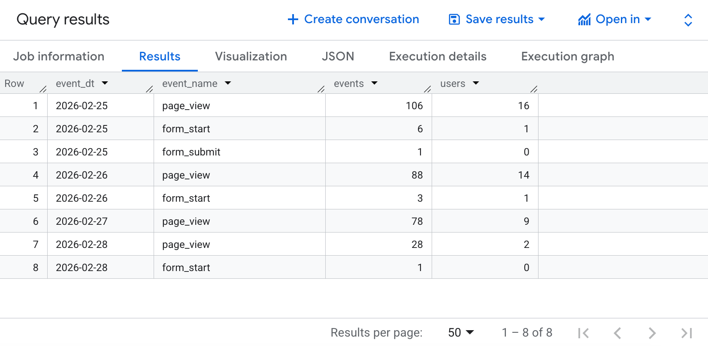
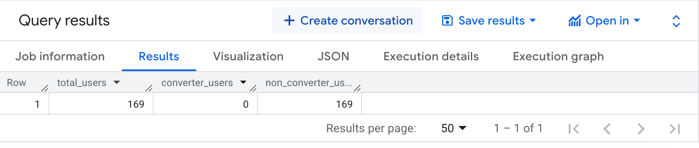
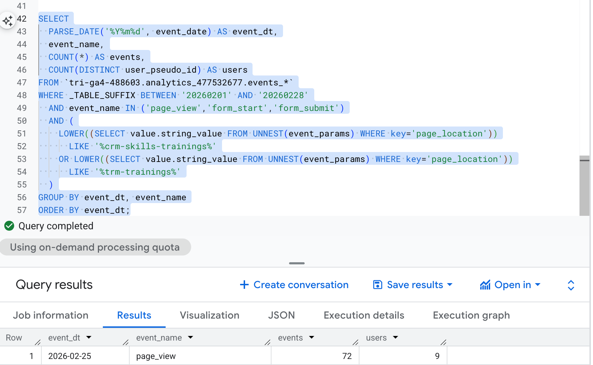
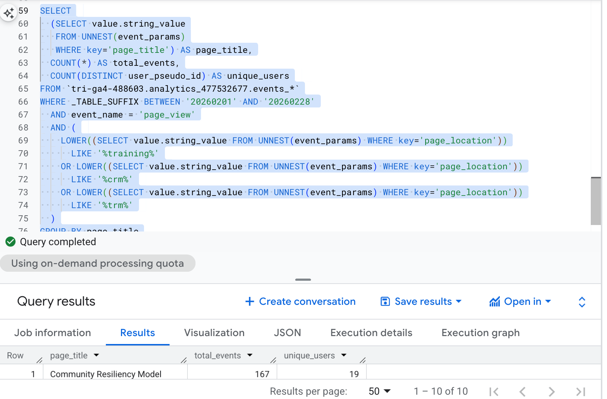
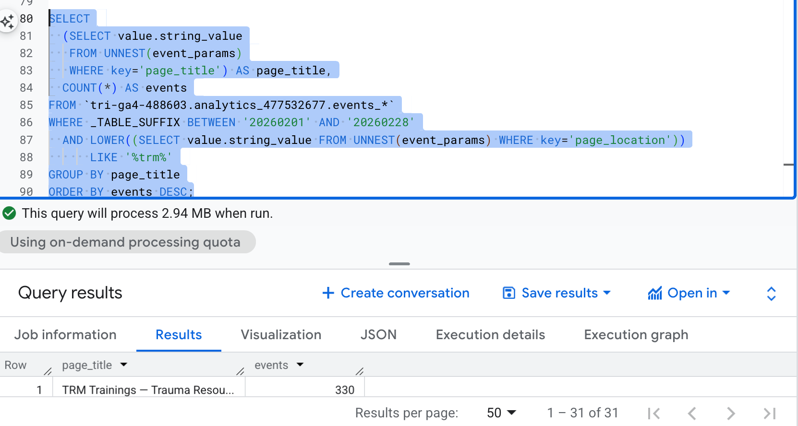
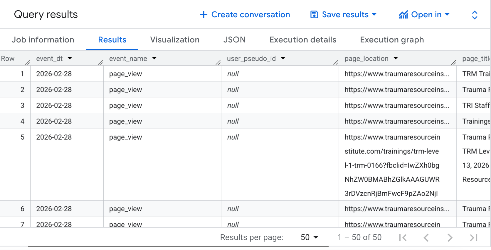
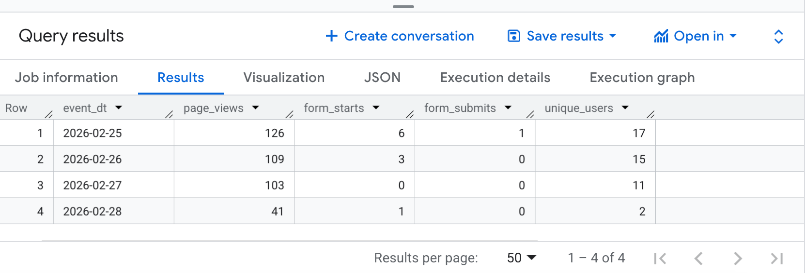
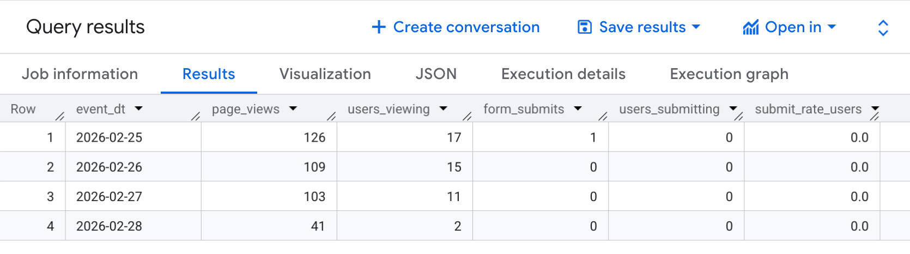

## Query 1: Filtering and Scoping

``` sql
SELECT
  PARSE_DATE('%Y%m%d', event_date) AS event_dt,
  event_name,
  COUNT(*) AS events,
  COUNT(DISTINCT user_pseudo_id) AS users
FROM `tri-ga4-488603.analytics_477532677.events_*`
WHERE _TABLE_SUFFIX BETWEEN '20260201' AND '20260228'             
  AND event_name IN ('page_view', 'form_start', 'form_submit')      
  AND (
    LOWER((SELECT value.string_value FROM UNNEST(event_params) WHERE key='page_location'))
      LIKE '%/crm-skills-trainings/%'
    OR LOWER((SELECT value.string_value FROM UNNEST(event_params) WHERE key='page_location'))
      LIKE '%/trm-trainings/%'
    OR LOWER((SELECT value.string_value FROM UNNEST(event_params) WHERE key='page_location'))
      LIKE '%find-a-training%'                                   
  )
GROUP BY event_dt, event_name
ORDER BY event_dt, events DESC;
```



### What query one means:

This query summarizes training-related user activity on the TRI website by day, counting how many events and unique users interacted with key training pages. The results show page views, form starts, and form submissions for CRM/TRM training pages during February 2026. For example, on February 25 there were 106 page views from 16 users, but only 6 form starts and 1 form submission, indicating that many users view the page but only a small portion begin or complete the registration form.

## Query 2: Filtering and Scoping Pt.2

``` sql
WITH base AS (
  SELECT
    user_pseudo_id,
    (SELECT value.string_value FROM UNNEST(event_params) WHERE key='page_location') AS page_location
  FROM `tri-ga4-488603.analytics_477532677.events_*`
  WHERE _TABLE_SUFFIX BETWEEN '20260215' AND '20260228'   
),
converters AS (
  SELECT DISTINCT user_pseudo_id
  FROM base
  WHERE LOWER(page_location) LIKE '%docs.google%'
)
SELECT
  COUNT(DISTINCT base.user_pseudo_id) AS total_users,
  COUNT(DISTINCT converters.user_pseudo_id) AS converter_users,
  COUNT(DISTINCT base.user_pseudo_id) - COUNT(DISTINCT converters.user_pseudo_id) AS non_converter_users
FROM base
LEFT JOIN converters USING (user_pseudo_id);
```



### What query two means:

This query segments users into converters and non-converters based on whether they reached a Google Forms confirmation page within the selected 14-day period. It first collects all users who generated events on the TRI website, then identifies converters as users whose page location contains “docs.google,” which serves as a proxy for a completed training registration form. The results show there being 169 total visitors and there being 0 converter users. Meaning all users are non-converters.

## Query 3: Grouping and aggregation

``` sql
SELECT
  PARSE_DATE('%Y%m%d', event_date) AS event_dt,
  event_name,
  COUNT(*) AS events,
  COUNT(DISTINCT user_pseudo_id) AS users
FROM `tri-ga4-488603.analytics_477532677.events_*`
WHERE _TABLE_SUFFIX BETWEEN '20260201' AND '20260228'
  AND event_name IN ('page_view','form_start','form_submit')
  AND (
    LOWER((SELECT value.string_value FROM UNNEST(event_params) WHERE key='page_location'))
      LIKE '%crm-skills-trainings%'
    OR LOWER((SELECT value.string_value FROM UNNEST(event_params) WHERE key='page_location'))
      LIKE '%trm-trainings%'
  )
GROUP BY event_dt, event_name
ORDER BY event_dt;
```



### What query 3 means:

This query aggregates training-related user activity by grouping events by date and event type for CRM and TRM training pages. The results show the number of total events and distinct users interacting with these pages within the specified date range. For example, on February 25, there were **72 page view events generated by 9 users** on training-related pages. This aggregation helps identify overall engagement with TRI training content and provides insight into how users interact with key pages in the training registration funnel.

## Query 4: Grouping and aggregation Pt.2

``` sql
SELECT
  (SELECT value.string_value
   FROM UNNEST(event_params)
   WHERE key='page_title') AS page_title,
  COUNT(*) AS total_events,
  COUNT(DISTINCT user_pseudo_id) AS unique_users
FROM `tri-ga4-488603.analytics_477532677.events_*`
WHERE _TABLE_SUFFIX BETWEEN '20260201' AND '20260228'
  AND event_name = 'page_view'
  AND (
    LOWER((SELECT value.string_value FROM UNNEST(event_params) WHERE key='page_location'))
      LIKE '%training%'
    OR LOWER((SELECT value.string_value FROM UNNEST(event_params) WHERE key='page_location'))
      LIKE '%crm%'
    OR LOWER((SELECT value.string_value FROM UNNEST(event_params) WHERE key='page_location'))
      LIKE '%trm%'
  )
GROUP BY page_title
ORDER BY total_events DESC
LIMIT 10;
```



### What query 4 means:

This query groups page view events by page title to identify which training-related pages on the TRI website receive the most engagement. The results show the total number of events and the number of unique users who viewed each page during the selected time period. For example, the “Community Resiliency Model” page generated **167 page view events from 19 unique users**, indicating strong user interest in that training content.

## Query 5: Unnest event parameters

``` sql
SELECT
  (SELECT value.string_value
   FROM UNNEST(event_params)
   WHERE key='page_title') AS page_title,
  COUNT(*) AS events
FROM `tri-ga4-488603.analytics_477532677.events_*`
WHERE _TABLE_SUFFIX BETWEEN '20260201' AND '20260228'
  AND LOWER((SELECT value.string_value FROM UNNEST(event_params) WHERE key='page_location'))
      LIKE '%trm%'
GROUP BY page_title
ORDER BY events DESC;
```



### What query 5 means:

This query identifies page view activity for pages related to Trauma Resiliency Model (TRM) training by filtering URLs that contain “trm.” The results show that the page titled **“TRM Trainings — Trauma Resource Institute” generated 330 events** during the selected date range. This indicates that TRM training content receives a notable amount of engagement from users visiting the site.

## Query 6: Unnest event parameters Pt. 2

``` sql
SELECT
  PARSE_DATE('%Y%m%d', event_date) AS event_dt,
  event_name,
  user_pseudo_id,
  ep_page_location.value.string_value AS page_location,
  ep_page_title.value.string_value AS page_title
FROM `tri-ga4-488603.analytics_477532677.events_*`
LEFT JOIN UNNEST(event_params) AS ep_page_location
  ON ep_page_location.key = 'page_location'
LEFT JOIN UNNEST(event_params) AS ep_page_title
  ON ep_page_title.key = 'page_title'
WHERE _TABLE_SUFFIX BETWEEN '20260201' AND '20260228'
  AND event_name = 'page_view'
LIMIT 50;
```



### What query 6 means:

This query extracts nested parameters from GA4 event data by using `UNNEST(event_params)` to retrieve the `page_location` and `page_title` associated with each event. The results display page view events along with the exact page URL and title that users visited on the TRI website. From the output, we can see multiple page views occurring on February 28, 2026 across different training-related pages. This demonstrates how GA4 stores page information as event parameters and how those parameters must be unnested to analyze specific page interactions.

## Query 7: CTE/ modular query structure

``` sql
WITH base_events AS (
  SELECT
    PARSE_DATE('%Y%m%d', event_date) AS event_dt,
    event_name,
    user_pseudo_id,
    (SELECT value.string_value
     FROM UNNEST(event_params)
     WHERE key = 'page_location') AS page_location
  FROM `tri-ga4-488603.analytics_477532677.events_*`
  WHERE _TABLE_SUFFIX BETWEEN '20260201' AND '20260228'  -- scoped date range
    AND event_name IN ('page_view', 'form_start', 'form_submit')
),
training_events AS (
  SELECT *
  FROM base_events
  WHERE LOWER(page_location) LIKE '%crm-skills-trainings%'
     OR LOWER(page_location) LIKE '%trm-trainings%'
     OR LOWER(page_location) LIKE '%find-a-training%'
)
SELECT
  event_dt,
  COUNTIF(event_name = 'page_view')   AS page_views,
  COUNTIF(event_name = 'form_start')  AS form_starts,
  COUNTIF(event_name = 'form_submit') AS form_submits,
  COUNT(DISTINCT user_pseudo_id)      AS unique_users
FROM training_events
GROUP BY event_dt
ORDER BY event_dt;
```



### What query 7 means:

This query uses a CTE to first create a base dataset of training-related events and then summarizes those events into a daily funnel view. The results show how many users viewed training pages, started the registration form, and submitted the form each day. For example, on February 25 there were **126 page views from 17 users**, but only **6 form starts and 1 form submission**, indicating a drop-off between viewing the training page and completing the form. This modular query structure helps clearly analyze how users progress through the training registration funnel.

## Query 8: Joining or combining

``` sql
WITH base AS (
  SELECT
    PARSE_DATE('%Y%m%d', event_date) AS event_dt,
    event_name,
    user_pseudo_id,
    (SELECT value.string_value
     FROM UNNEST(event_params)
     WHERE key = 'page_location') AS page_location
  FROM `tri-ga4-488603.analytics_477532677.events_*`
  WHERE _TABLE_SUFFIX BETWEEN '20260201' AND '20260228'
    AND event_name IN ('page_view','form_submit')
),
training_only AS (
  SELECT *
  FROM base
  WHERE LOWER(page_location) LIKE '%crm-skills-trainings%'
     OR LOWER(page_location) LIKE '%trm-trainings%'
     OR LOWER(page_location) LIKE '%find-a-training%'
),
daily_pageviews AS (
  SELECT
    event_dt,
    COUNT(*) AS page_views,
    COUNT(DISTINCT user_pseudo_id) AS users_viewing
  FROM training_only
  WHERE event_name = 'page_view'
  GROUP BY event_dt
),
daily_submits AS (
  SELECT
    event_dt,
    COUNT(*) AS form_submits,
    COUNT(DISTINCT user_pseudo_id) AS users_submitting
  FROM training_only
  WHERE event_name = 'form_submit'
  GROUP BY event_dt
)
SELECT
  pv.event_dt,
  pv.page_views,
  pv.users_viewing,
  COALESCE(fs.form_submits, 0) AS form_submits,
  COALESCE(fs.users_submitting, 0) AS users_submitting,
  SAFE_DIVIDE(COALESCE(fs.users_submitting, 0), pv.users_viewing) AS submit_rate_users
FROM daily_pageviews pv
LEFT JOIN daily_submits fs
  ON pv.event_dt = fs.event_dt
ORDER BY pv.event_dt;
```



### What query 8 means:

This query combines multiple CTEs and joins daily page view activity with daily form submission activity to analyze the training registration funnel. The results show how many users viewed training pages each day, how many submitted the form, and the resulting submission rate. For example, on February 25 there were **126 page views from 17 users but only 1 form submission**, indicating a large drop-off between viewing the page and completing the registration form. Overall, the results suggest that while users are visiting training pages, very few are progressing to the final form submission step.
