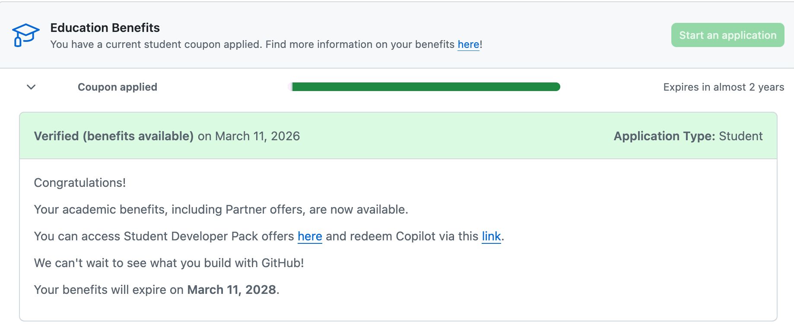

# Better in Positron over RStudio

One thing I like about Positron compared with RStudio is that it supports multiple languages like R and Python more naturally, making it useful for broader data science work. I also like the more modern interface and improved tools for exploring datasets and navigating files.

### Positron Assistant chat (in-IDE chat panel)

-   You can use the Assistant to **ask questions about your code**, explain errors, generate/refactor code, and get “next steps” suggestions

# Positron AI Installed

Currently I do not have any additional Ai packages installed for Positron.

# GitHub Copilot: helpful or distracting?

It’s **helpful**

-   **Debugging support:** suggests missing parentheses, pipe placement, object names.

-   **Boilerplate + syntax speed:** quick dplyr pipelines, ggplot scaffolds, function templates.

# Github Education Application

